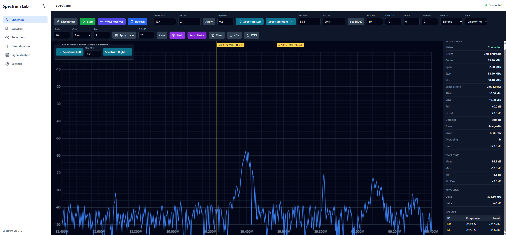
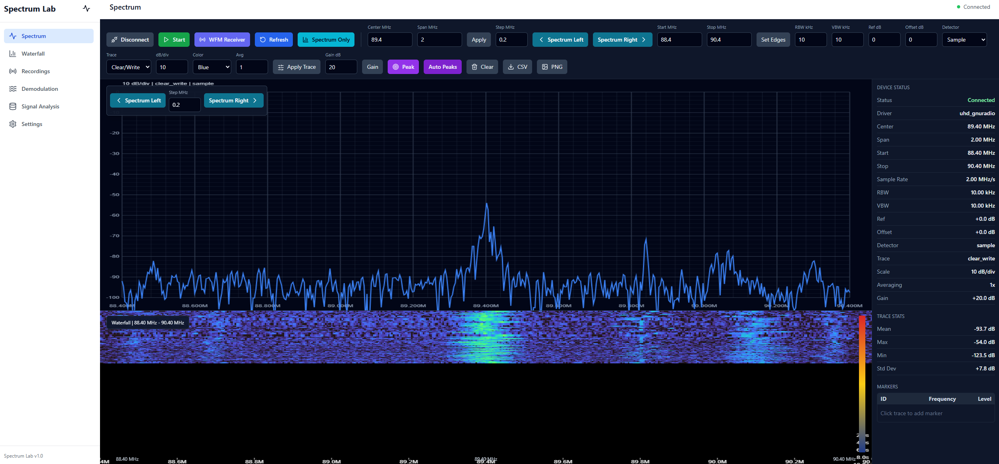
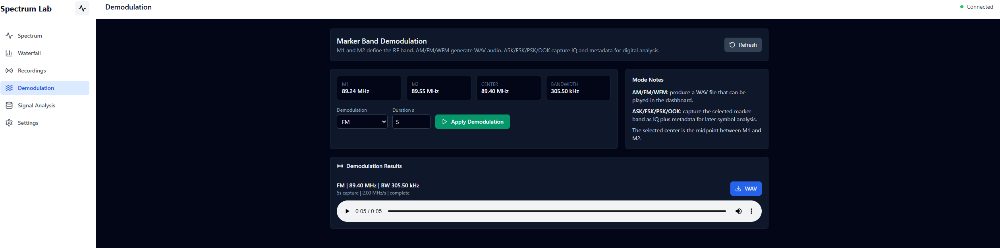
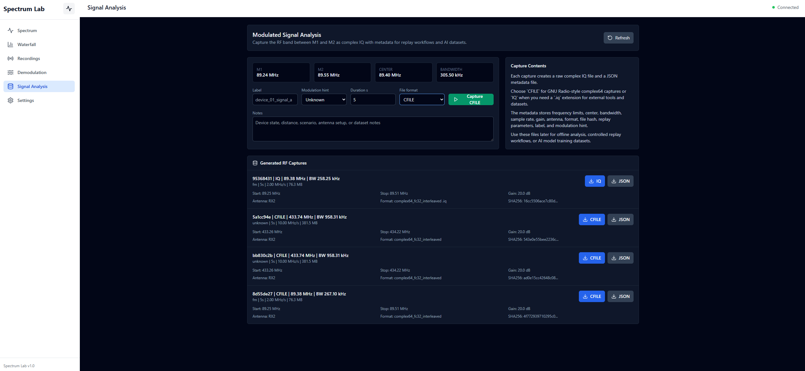

# SpectraEase - RF Spectrum Analyzer

SpectraEase is a web-based RF spectrum analyzer for real SDR hardware. The current development target is an **Ettus Research USRP-B200** connected over USB and accessed through **UHD/GNU Radio** using the RadioConda Python environment.

The application is built with a FastAPI backend and a React/TypeScript frontend. It visualizes live RF spectrum data captured from the device, exposes analyzer-style controls, and supports real capture workflows.

## Current Hardware Path

- Device: **USRP-B200 from Ettus Research**
- Driver/runtime path: **UHD + GNU Radio**
- Python runtime for SDR tools: **RadioConda**
- Default antenna: `RX2`
- Default center frequency: `89.4 MHz`
- Default sample rate/span: `2 MS/s`
- Default gain: `20 dB`


## Features

- Live RF spectrum from the connected USRP-B200
- Analyzer controls for center frequency, start/stop, span, RBW, VBW, reference level, gain, detector mode, and averaging
- Spectrum pan controls to move the tuned window left or right without typing a new frequency
- Marker creation on the trace with frequency and interpolated signal level
- Marker delta readout between the first two markers
- Marker-band demodulation using M1 and M2 as RF limits
- AM/FM/WFM demodulation with WAV audio playback and export from the dashboard
- ASK/FSK/PSK/OOK marker-band IQ capture with metadata export for digital analysis
- Modulated signal analysis tab for marker-limited IQ dataset capture
- Persistent `.cfile` and `.iq` capture libraries for replay workflows and AI model training datasets
- Automatic local peak markers
- Marker dragging directly on the spectrum canvas
- Peak marker detection
- Trace statistics: mean, maximum, minimum, and standard deviation
- CSV export for trace points
- PNG export for the current spectrum canvas
- Mouse-wheel zoom on spectrum span
- Crosshair cursor readout with frequency and level
- Trace modes: Clear/Write, Average, Max Hold, Min Hold, and Video Average
- Detector modes: Sample, RMS, Average, Peak, Max Hold, Min Hold, and Video
- Display controls for reference level, dB/div, offset, and color scheme
- Basic SCPI-style REST command endpoint for external control
- Device status panel showing connection state, driver, sample rate, gain, center, span, start, and stop
- Recording/session screens for capture management
- FastAPI REST API with OpenAPI docs
- React/Vite frontend with canvas-based spectrum rendering

## Tech Stack

| Component | Technology |
|-----------|------------|
| Backend | FastAPI, Python |
| Frontend | React 18, TypeScript, Vite |
| SDR | UHD, GNU Radio, RadioConda |
| Device | Ettus Research USRP-B200 |
| Storage | JSON/file-based project storage |

## Run On Windows

Use PowerShell from the project root:

```powershell
cd C:\Users\Usuario\Desktop\NICS\Spectum_lab\spectrum-lab

$env:DEFAULT_CENTER_FREQUENCY_HZ="89400000"
$env:DEFAULT_SAMPLE_RATE_HZ="2000000"
$env:DEFAULT_GAIN_DB="20"
$env:DEFAULT_ANTENNA="RX2"
$env:UHD_DEVICE_ARGS=""

powershell -ExecutionPolicy Bypass -File .\scripts\run_dev.ps1 -UseRealSdr 1 -RadioCondaPythonPath "C:\Users\Usuario\radioconda\python.exe"
```

Then open:

- Frontend: `http://localhost:5173`
- Backend API: `http://localhost:8000`
- API docs: `http://localhost:8000/docs`

## Basic Workflow

1. Connect the USRP-B200 over USB.
2. Start the app with `run_dev.ps1` and `-UseRealSdr 1`.
3. Open the frontend.
4. Click `Connect USB`.
5. Click `Start`.
6. Tune center/span or start/stop from the controls.
7. Use `Spectrum Left` and `Spectrum Right` to move across the band.
8. Click the spectrum to add markers with frequency and signal level.
9. Open `Demodulation` to demodulate or capture the RF band between M1 and M2.
10. Open `Signal Analysis` to capture the marker-limited signal as IQ plus metadata.

## Application Screenshots

### Live Spectrum View

The main spectrum view shows the live RF trace from the USRP-B200 with analyzer controls, marker placement, cursor readout, and export options.



### Spectrum And Waterfall View

The combined view splits the analyzer horizontally so the live spectrum trace and the waterfall history share the same center frequency and span.



## Marker-Band Demodulation

The `Demodulation` tab uses the first two spectrum markers as the selected RF band:

1. Create M1 and M2 on the spectrum trace.
2. Open `Demodulation`.
3. Select `AM`, `FM`, `WFM`, `ASK`, `FSK`, `PSK`, or `OOK`.
4. Set the capture duration.
5. Click `Apply Demodulation`.

For `AM`, `FM`, and `WFM`, the backend captures real IQ from the USRP-B200, demodulates it, generates a WAV file, and exposes it for playback/download in the dashboard.

For `ASK`, `FSK`, `PSK`, and `OOK`, the backend captures the marker-limited IQ plus metadata for later digital analysis/export. These modes do not currently generate dashboard audio.

Example FM workflow using a broadcast channel around `98.4 MHz` in Spain:



## Modulated Signal Analysis Captures

The `Signal Analysis` tab is for dataset-style IQ capture, not audio demodulation. It uses M1 and M2 as the capture limits and creates:

- `.cfile` or `.iq`: raw complex64 IQ samples, selected by the user
- `.json`: metadata with center, start/stop, bandwidth, sample rate, gain, antenna, format, SHA256, label, modulation hint, and replay parameters

Generated files are stored under:

```text
backend/app/infrastructure/persistence/storage/recordings/modulated_signal_captures/
backend/app/infrastructure/persistence/storage/recordings/modulated_signal_iq_captures/
```

The UI always lists the files found in both directories and provides separate downloads for the RF data file and metadata.

Example marker-band capture configured to generate `.cfile` or `.iq` datasets for replay, offline analysis, or AI model training:



## Important Environment Variables

| Variable | Purpose |
|----------|---------|
| `DEFAULT_CENTER_FREQUENCY_HZ` | Initial tuned center frequency |
| `DEFAULT_SAMPLE_RATE_HZ` | Initial sample rate and spectrum span |
| `DEFAULT_GAIN_DB` | Initial RF gain |
| `DEFAULT_ANTENNA` | UHD antenna name, currently `RX2` |
| `UHD_DEVICE_ARGS` | Optional UHD device arguments |
| `RADIOCONDA_PYTHON` | Python executable with GNU Radio/UHD installed |
| `REAL_SDR_FPS` | Spectrum worker frame rate, default `10` |
| `REAL_SDR_MAX_FFT_SIZE` | Maximum FFT size used to approach requested RBW, default `65536` |

The frontend can change the active analyzer settings at runtime. These variables only define startup defaults.

RBW is implemented by selecting an FFT size from the active sample rate and requested RBW. If the requested RBW would require more than `REAL_SDR_MAX_FFT_SIZE`, the backend uses the closest practical FFT size and reports the effective RBW in each spectrum frame. VBW is implemented as frame-to-frame video smoothing, so it is only meaningful at values near or below the live frame rate.

## SCPI-Style Control

Basic SCPI-style commands can be sent through:

```text
POST /api/spectrum/scpi
```

Supported examples:

```text
SENS:FREQ:CENT 89.4MHz
SENS:FREQ:SPAN 2MHz
DISP:TRAC:Y:RLEV 0dBm
DISP:TRAC:Y:SCAL:PDIV 10dB
```

## RF Safety Guardrails

The backend validates hardware-facing parameters before opening or retuning the USRP-B200:

| Limit | Default |
|-------|---------|
| Center frequency | `70 MHz` to `6 GHz` |
| Sample rate / span | `200 kS/s` to `61.44 MS/s` |
| Gain | `0 dB` to `60 dB` |
| RBW | `1 Hz` to `1 MHz` |
| VBW | `1 Hz` to `1 MHz` |

The default sample-rate ceiling follows the USRP-B200/B210 USB 3.0 host sample-rate specification for single-channel use. Practical sustained rates near `61.44 MS/s` depend on USB 3.0 controller quality, host load, channel count, and DSP load; B210 2x2 operation is lower. These limits can be overridden with `RF_MIN_CENTER_FREQUENCY_HZ`, `RF_MAX_CENTER_FREQUENCY_HZ`, `RF_MIN_SAMPLE_RATE_HZ`, `RF_MAX_SAMPLE_RATE_HZ`, `RF_MAX_SPAN_HZ`, `RF_MIN_GAIN_DB`, and `RF_MAX_GAIN_DB`.

Software limits do not protect the RF input from excessive external power. Use appropriate antennas, attenuators, and RF front-end protection when connecting unknown signals.

## Project Structure

```text
spectrum-lab/
  backend/
    app/
      config/
      domain/
      application/
      infrastructure/
    tools/
      capture_and_demodulate_fm.py
      spectrum_stream_worker.py
      wfm_receiver_qt.py
  frontend/
    src/
      app/
      domain/
      presentation/
      shared/
  scripts/
    run_dev.ps1
    run_dev.sh
    init_project.sh
```
